# AEM Slider Component

A comprehensive, responsive slider component built for Adobe Experience Manager (AEM), featuring dynamic data loading, responsive breakpoints, and smooth animations using Swiper.js.

**Why Swiper Over Simple Carousel Implementation?** This Swiper-based solution delivers enterprise-grade value that simple CSS/JavaScript carousels cannot match. **Key advantages include:** (1) **Native Touch & Swipe Support** - seamless mobile interactions with momentum scrolling and gesture recognition, (2) **Hardware-Accelerated Performance** - CSS3 transforms ensure 60fps animations across all devices, (3) **Intelligent Responsive Breakpoints** - automatically adjusts slide counts (1→2→3→4) based on screen size without complex CSS media queries, (4) **Built-in Accessibility** - ARIA labels, keyboard navigation, and screen reader support out-of-the-box, (5) **Advanced Visual Effects** - smooth opacity transitions and 3D transforms impossible with basic implementations, (6) **Cross-Browser Compatibility** - handles browser inconsistencies automatically, (7) **Rich Event API** - extensive lifecycle hooks for custom integrations, (8) **Performance Optimizations** - virtual slides, lazy loading, and efficient DOM manipulation for large datasets, (9) **Centralized Configuration Management** - all slider behavior, responsive breakpoints, event handlers, navigation controls, and visual effects are managed within a single configuration object, eliminating scattered code, and (10) **Production-Ready Reliability** - battle-tested library used by millions of websites. Simple carousels require custom coding for each of these features, leading to maintenance nightmares and inconsistent user experiences. Swiper consolidates all this functionality into a single, well-documented, continuously updated solution.

## 🌟 Features

- **Dynamic Data Loading**: Automatically fetches content from JSON data sources
- **Responsive Design**: Adapts to different screen sizes with customizable breakpoints
- **Performance Optimized**: Lazy loads Swiper.js library from CDN after page load
- **Visual Feedback**: Custom opacity effects for slide visibility
- **Accessible Navigation**: Keyboard and touch-friendly navigation controls
- **Color Theming**: Supports multiple color schemes (brown/default)
- **Date Sorting**: Automatically sorts content by date in descending order

## Environments
- Preview: https://main--slider--meejain.aem.page/
- Live: https://main--slider--meejain.aem.live/

## 🏗️ Architecture Overview

### Component Structure
```
blocks/slider/
├── slider.js      # Main component logic
├── slider.css     # Component styling
└── README.md      # Documentation
```

### Data Flow Architecture

```mermaid
flowchart LR
    A[Start: decorate<br/>function called] --> B[Fetch Data from<br/>/lorem-index.json]
    B --> C{Data Available?}
    C -->|No| D[Use Empty Array]
    C -->|Yes| E[Sort by Date<br/>Descending]
    D --> F[Create News Objects]
    E --> F
    
    F --> G[Parse to Cards Format]
    G --> H[Build Block Structure]
    H --> I[Apply Fade Animation]
    I --> J[Decorate & Load Block]
    
    J --> K[Transform to<br/>Swiper Structure]
    K --> L[Add CSS Classes:<br/>- swiper<br/>- slider-swiper<br/>- swiper-wrapper<br/>- swiper-slide]
    L --> M[Add Navigation<br/>Buttons]
    
    M --> N[Load Swiper<br/>from CDN]
    N --> O{Swiper Loaded?}
    O -->|No| P[Error Handling]
    O -->|Yes| Q[Initialize Swiper<br/>Configuration]
    
    Q --> R[Set Responsive<br/>Breakpoints:<br/>600px: 2 slides<br/>900px: 3 slides<br/>1200px: 4 slides]
    R --> S[Configure Event<br/>Handlers:<br/>- init<br/>- slideChange<br/>- breakpoint]
    S --> T[Apply Visual<br/>Opacity Effects:<br/>Visible: opacity 1<br/>Hidden: opacity 0.2]
    T --> U[Slider Ready<br/>& Interactive]
    
    style A fill:#d4edda,stroke:#155724,color:#000
    style B fill:#cce5ff,stroke:#004085,color:#000
    style G fill:#e7f3ff,stroke:#0056b3,color:#000
    style Q fill:#fff3cd,stroke:#856404,color:#000
    style U fill:#d1ecf1,stroke:#0c5460,color:#000
    style P fill:#f8d7da,stroke:#721c24,color:#000
```



## 🔧 Implementation Details

### Core Components

#### 1. News Class
```javascript
class News {
  constructor(newsTitle, newsCategory, newsImage, newsPath, newsDescription, newsDate, articleColor)
}
```
Data model that encapsulates all properties of a slider item.

#### 2. Data Fetching (`getSliderdata`)
- Fetches data from `/lorem-index.json`
- Implements error handling with `safeFetch`
- Sorts data by date (dd.mm.yyyy format) in descending order
- Returns empty array if no data is available

#### 3. Result Parsing (`resultParsers`)
- Transforms raw JSON data into card-formatted blocks
- Handles multiple categories (comma-separated)
- Applies color theming based on `article-color` metadata
- Creates optimized images with lazy loading

#### 4. Main Decorator Function (`decorate`)
- Orchestrates the entire component initialization
- Builds AEM block structure
- Transforms HTML for Swiper compatibility
- Initializes Swiper with advanced configuration

### Advanced Swiper Configuration (Lines 238-269)

The Swiper initialization block (lines 238-269) provides sophisticated slider functionality that simplifies complex option handling. **All slider behavior, responsive breakpoints, event handlers, navigation controls, and visual effects are centrally managed within a single configuration object**, eliminating the need for scattered JavaScript event listeners, multiple CSS media queries, and fragmented initialization code.

#### 🎯 **Responsive Breakpoints Management**
```javascript
breakpoints: {
  600: { slidesPerView: 2 },
  900: { slidesPerView: 3 },
  1200: { slidesPerView: 4 },
}
```
**Benefits:**
- Automatically adapts slide count based on screen size
- No manual CSS media queries needed
- Smooth transitions between breakpoints

#### 🔄 **Dynamic Opacity Control**
The `updateSlideOpacity` function provides visual feedback:
- **Visible slides**: `opacity: 1` with `swiper-slide-visible` class
- **Hidden slides**: `opacity: 0.2` for subtle visual hierarchy
- **Automatic updates**: Responds to slide changes and screen resizes

#### 📱 **Event-Driven Architecture**
```javascript
on: {
  init() { updateSlideOpacity(this); },
  slideChange() { updateSlideOpacity(this); },
  breakpoint() { setTimeout(() => updateSlideOpacity(this), 100); },
}
```
**Advantages:**
- **init**: Ensures proper visual state on component load
- **slideChange**: Updates opacity when user navigates
- **breakpoint**: Handles screen resize scenarios with debouncing

#### 🛡️ **Error Resilience**
- Graceful fallback if Swiper fails to load
- Try-catch blocks prevent JavaScript errors
- Progressive enhancement approach

#### ⚡ **Performance Optimizations**
- CDN-based loading reduces bundle size
- Lazy initialization after page load
- Efficient DOM manipulation with minimal reflows

### Why This Configuration Approach is Superior

1. **Declarative Configuration**: All slider options are centralized in one configuration object
2. **Automatic Responsive Handling**: No need to manually handle different screen sizes
3. **Visual Consistency**: Consistent opacity effects across all breakpoints
4. **Error Boundaries**: Multiple layers of error handling prevent crashes
5. **Event-Driven Updates**: Reactive updates based on user interactions and system events

## 📊 Data Structure

### Expected JSON Format
```json
{
  "data": [
    {
      "title": "Article Title",
      "category": "Category1,Category2",
      "description": "Article description",
      "date": "15.07.2024",
      "image": "https://example.com/image.jpg",
      "path": "/article-path",
      "article-color": "brown"
    }
  ]
}
```

### Supported Properties
- `title`: Article headline
- `category`: Comma-separated categories
- `description`: Article summary
- `date`: Format "dd.mm.yyyy"
- `image`: Full image URL
- `path`: Article link path
- `article-color`: Theme color ("brown" or default)

## 🎨 Styling & Theming

### CSS Classes Applied
- `.swiper`: Main Swiper container
- `.slider-swiper`: Custom slider identifier
- `.swiper-wrapper`: Slides container
- `.swiper-slide`: Individual slide
- `.color-brown`/`.color-default`: Theme variations
- `.swiper-slide-visible`: Currently visible slides

### Custom Navigation
- Custom SVG icons for navigation arrows
- Positioned outside viewport for clean design
- Responsive positioning based on container width

## 🔧 Dependencies

### Core Dependencies
- **AEM Scripts**: `aem.js`, `dom-helpers.js`, `utils.js`
- **Data Fetching**: `ffetch.js` for HTTP requests
- **Swiper.js**: Loaded dynamically from CDN
- **CSS**: Swiper styles loaded from CDN

### External Resources
- Swiper v11 from `cdn.jsdelivr.net`
- Custom SVG icons in `/icons/` directory
- Optimized images via AEM's `createOptimizedPicture`

## 🚀 Usage

### Basic Implementation
1. Add slider block to your AEM page
2. Ensure JSON data source is available at `/lorem-index.json`
3. Component will automatically initialize with responsive behavior

### Customization
- Modify breakpoints in Swiper configuration
- Adjust opacity values in `updateSlideOpacity` function
- Add custom CSS classes for additional theming
- Update navigation icons by replacing SVG files

## 🌐 Environments
- Preview: https://main--{repo}--{owner}.aem.page/
- Live: https://main--{repo}--{owner}.aem.live/

## 📚 AEM Documentation

Before using the aem-boilerplate, we recommend you to go through the documentation on https://www.aem.live/docs/ and more specifically:
1. [Developer Tutorial](https://www.aem.live/developer/tutorial)
2. [The Anatomy of a Project](https://www.aem.live/developer/anatomy-of-a-project)
3. [Web Performance](https://www.aem.live/developer/keeping-it-100)
4. [Markup, Sections, Blocks, and Auto Blocking](https://www.aem.live/developer/markup-sections-blocks)

## 🛠️ Development Setup

### Installation
```sh
npm i
```

### Linting
```sh
npm run lint
```

### Local Development
1. Create a new repository based on the `aem-boilerplate` template and add a mountpoint in the `fstab.yaml`
1. Add the [AEM Code Sync GitHub App](https://github.com/apps/aem-code-sync) to the repository
1. Install the [AEM CLI](https://github.com/adobe/helix-cli): `npm install -g @adobe/aem-cli`
1. Start AEM Proxy: `aem up` (opens your browser at `http://localhost:3000`)
1. Open the `{repo}` directory in your favorite IDE and start coding :)

## 🔍 Troubleshooting

### Common Issues
1. **Slider not initializing**: Check console for Swiper CDN loading errors
2. **Images not loading**: Verify image URLs and AEM asset paths
3. **Responsive issues**: Ensure CSS breakpoints match Swiper configuration
4. **Data not loading**: Verify JSON endpoint availability and format

### Debug Tips
- Use browser dev tools to inspect Swiper instance
- Check network tab for CDN resource loading
- Verify JSON data structure matches expected format